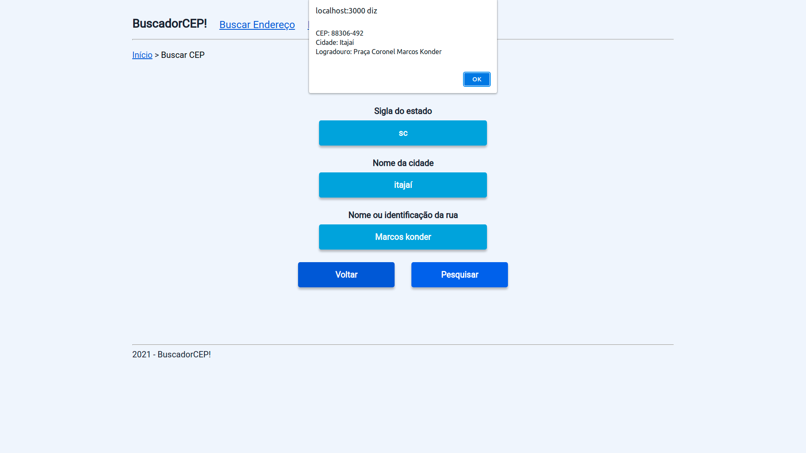

# BuscadorCEP!

O aplicativo BuscadorCEP! permite que você encontre código de endereçamento postais (CEP).  
Se você já tiver o CEP em mãos e gostaria de buscar seu endereço, o BuscadorCEP! também vai te ajudar.

## Funcionalidaes

- Encontre o CEP de uma rua informando a sigla do estado, cidade e nome da rua. O aplicativo aceita nomes com letras maiúsculas, minúsculas, com acentos e espaços entre palavras.
- Encontre o endereço referente a um CEP.

## Imagens do aplicativo

- Tela inicial
  

- Tela Buscar Endereço  
  

- Tela Resultado Endereço
  

- Tela Buscar CEP
  

- Tela Resultado CEP
  

## Tecnologias utilizadas

- [ReactJs](https://pt-br.reactjs.org/)
- [TypeScript](https://www.typescriptlang.org/)
- [React Router](https://reactrouter.com/)
- [Styled components](https://styled-components.com/)
- [Axios](https://axios-http.com/ptbr/)

## Clone este repositório para a sua máquina

```bash
git clone https://github.com/Cipriano99/BuscadorCEP
```

## Instale todas as dependências

```bash
#Com o npm
npm install #ou npm -i

#Com Yarn
yarn install #ou somente yarn
```

## Execute o BuscadorCEP! na sua máquina

```bash
#Com o npm
npm run start

#Com Yarn
yarn srtat
```

Após executar o comando acima, a aplicação irá abrir automaticamente no [http://localhost:3000](http://localhost:3000) no seu navegador padrão.
